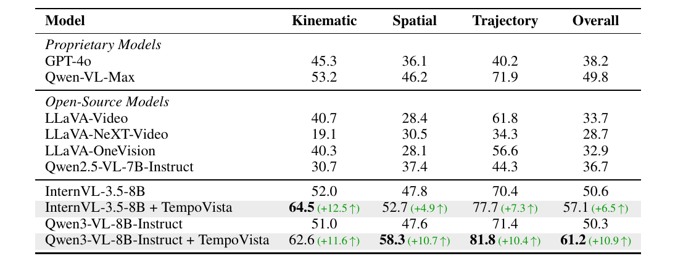

# Dyn-3D: Unveiling and Resolving Ego-Motion Ambiguity in Vision-Language Models

This repository contains the official implementation of TempoVista, including the Dyn-3D benchmark annotations, training and evaluation code, and the quantitative results reported in the paper.

## Dyn-3D Benchmark



*Quantitative evaluation on Dyn-3D. Values are accuracy (%); higher is better.*

Dyn-3D is a controlled benchmark for video-based 3D understanding. It contains 16,063 four-option questions from 835 rendered videos and 167 held-out scenes, covering 19 question types (B1--B19). The benchmark evaluates kinematic perception, spatial understanding, and implicit trajectory reasoning while separating visual changes from physical motion through controlled 3D scene and object paths.

## Model Weights

The released TempoVista models are available on Hugging Face:

- [Qwen3-VL-8B-Instruct + TempoVista](https://huggingface.co/light0626/TempoVista/tree/main/qwen_kinematic_gspo)
- [InternVL-3.5-8B + TempoVista](https://huggingface.co/light0626/TempoVista/tree/main/internvl_kinematic_gspo)

## 1. Installation

The code is tested with Python 3.9+ and CUDA-enabled PyTorch. The provided training configurations use two GPUs and bfloat16.

```bash
conda create -n tempovista python=3.10 -y
conda activate tempovista

# Install a PyTorch and torchvision build compatible with your CUDA version.
pip install -e code/EasyR1 --no-deps
pip install -r code/EasyR1/requirements-qwen3vl8b-easyr1.txt
pip install ms-swift       # only for Qwen SFT
pip install opencv-python  # only for raw-video frame extraction
```

The main dependency versions are `transformers>=4.57.0,<5.0.0`, `vllm==0.11.0`, and `ray[default]>=2.47,<2.50`.

## 2. Repository layout

```text
Dyn-3D/
├── code/
│   ├── EasyR1/                    # multimodal RL training framework
│   └── vlm/                       # sampling, training, merging, and evaluation
├── data/
│   └── Dyn-3D.jsonl               # benchmark annotations
└── assets/
    └── dyn3d_results.png          # evaluation table
```

## 3. Data preparation

The benchmark annotation file is provided at `data/Dyn-3D.jsonl`. Video frames and training samples are kept outside this repository; set their paths locally when running the corresponding scripts.

For raw videos arranged as `*_hq/video_*.mp4`, extract the frame formats used by the evaluation scripts:

```bash
VLM_VIDEO_ROOT=/path/to/videos \
VLM_OUTPUT_FRAMES_DIR=/path/to/flowfps_frames \
python code/vlm/extract_flowfps_frames.py

VLM_VIDEO_ROOT=/path/to/videos \
VLM_OUTPUT_FRAMES_DIR=/path/to/se3fps_frames \
python code/vlm/extract_se3fps_frames.py
```

## 4. Evaluate Dyn-3D

Set the local paths for the selected vision-language model and extracted frames, then run:

```bash
python code/vlm/eval_benchmark_qwen3vl.py \
  --benchmark-path data/Dyn-3D.jsonl \
  --frames-root /path/to/flowfps_frames \
  --base-model-path /path/to/qwen3-vl-model \
  --output-dir outputs/eval_qwen \
  --status-path outputs/eval_qwen/status.json \
  --status-jsonl-path outputs/eval_qwen/status.jsonl \
  --sample-size 1000 \
  --seed 42
```

For InternVL, use the corresponding evaluator:

```bash
python code/vlm/eval_benchmark_internvl.py \
  --benchmark-path data/Dyn-3D.jsonl \
  --frames-root /path/to/flowfps_frames \
  --base-model-path /path/to/internvl3.5-model \
  --output-dir outputs/eval_internvl \
  --status-path outputs/eval_internvl/status.json \
  --status-jsonl-path outputs/eval_internvl/status.jsonl \
  --sample-size 1000 \
  --seed 42
```

The evaluators write per-question predictions and a summary under the selected output directory.

## 5. Supervised fine-tuning

Place the SFT training file at the path expected by the configuration, set `MODEL_PATH` to a local base model directory, and run:

```bash
MODEL_PATH=/path/to/qwen3-vl-model \
OUTPUT_DIR="$PWD/outputs/qwen_sft" \
bash code/vlm/scripts/train_qwen_sft.sh

MODEL_PATH=/path/to/internvl3.5-model \
OUTPUT_DIR="$PWD/outputs/internvl_sft" \
bash code/vlm/scripts/train_internvl_sft.sh
```

The scripts use the SFT data and frame paths configured in their respective source files.

## 6. Kinematic-GSPO

After SFT, merge the adapter into a standalone model directory and launch the kinematic-GSPO run:

```bash
python code/vlm/scripts/merge_qwen3vl_lora_for_easyr1.py \
  --base-model /path/to/qwen3-vl-model \
  --adapter /path/to/qwen_sft_adapter \
  --output outputs/qwen_sft_merged

MODEL_PATH="$PWD/outputs/qwen_sft_merged" \
CONFIG_NAME=qwen_kinematic_gspo.yaml \
OUTPUT_DIR="$PWD/outputs/qwen_kinematic_gspo" \
CUDA_VISIBLE_DEVICES=0,1 \
bash code/vlm/scripts/run_gspo.sh
```

The configuration files are under `code/EasyR1/examples`. The kinematic-GSPO setup uses eight frames per sample and the kinematic reward defined by the training pipeline.

## 7. Acknowledgements

This project builds upon [EasyR1](https://github.com/hiyouga/EasyR1), [Qwen3-VL](https://github.com/QwenLM/Qwen3-VL), [InternVL](https://github.com/OpenGVLab/InternVL), [3D Gaussian Splatting](https://github.com/graphdeco-inria/gaussian-splatting), [nerfstudio](https://github.com/nerfstudio-project/nerfstudio), and [ScanNet++](https://kaldir.vc.in.tum.de/scannetpp/).

Please follow the licenses and access terms of the upstream projects and datasets when using this code.

## 8. Citation

```bibtex
@article{dyn3d2026,
  title   = {Dyn-3D: Unveiling and Resolving Ego-Motion Ambiguity in Vision-Language Models},
  author  = {Anonymous Authors},
  journal = {arXiv preprint},
  year    = {2026}
}
```
